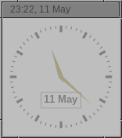

# 7aclock

Analogowy zegar X11 z opcjonalnym wyświetlaniem daty na tarczy. Inspirowany `xclock` i `urxvclock`.



## Funkcje

- Wskazówki lancetowe (zaostrzone końce)
- Opcjonalne wyświetlanie daty wewnątrz tarczy
- Obsługa przezroczystości tła (wymaga compositora, np. picom)
- Flicker-free rendering (podwójne buforowanie)
- Inteligentny sleep: bez wskazówki sekund zegar budzi się raz na minutę
- Pełna obsługa geometrii X11 włącznie z ujemnymi offsetami (np. `-5+5` = 5px od prawej krawędzi)
- Tytuł okna z formatowaniem strftime (np. `%H:%M`)
- WM_CLASS dla reguł window managera

## Kompilacja

Wymagane zależności: `libx11`, `cairo`, `cairo-xlib`.

```sh
make
sudo make install PREFIX=/usr/local
```

## Użycie

```sh
7aclock [opcje]
```

### Opcje

| Opcja | Opis | Domyślnie |
|---|---|---|
| `-date` | Wyświetl datę na tarczy | wyłączone |
| `-dateformat FMT` | Format daty (strftime) | `%d %b` |
| `-noseconds` | Ukryj wskazówkę sekund | wyłączone |
| `-noring` | Ukryj zewnętrzny pierścień tarczy | wyłączone |
| `-alpha N` | Przezroczystość tła 0.0–1.0 | `1.0` |
| `-bg COLOR` | Kolor tła | `#1a1a2e` |
| `-fg COLOR` | Kolor tarczy i kresek | `#e0e0e0` |
| `-hd COLOR` | Kolor wskazówek godzin i minut | `#e0e0e0` |
| `-sd COLOR` | Kolor wskazówki sekund | `#e05050` |
| `-dc COLOR` | Kolor tekstu daty | jak `-fg` |
| `-db COLOR` | Tło okienka daty | jak `-bg` |
| `-padding N` | Wewnętrzny margines w pikselach | `4` |
| `-title FMT` | Tytuł okna (obsługuje strftime) | `7aclock` |
| `-name NAME` | WM_CLASS instance name | `7aclock` |
| `-class CLASS` | WM_CLASS class name | `7aclock` |
| `-geometry WxH+X+Y` | Geometria okna | — |
| `-update MS` | Stały interwał odświeżania (ms) | auto |

Naciśnij `q` lub `Escape` aby zamknąć.

## Przykłady

```sh
# Zegar z datą, bez pierścienia, w rogu ekranu
7aclock -geometry 150x150-5+5 -date -noseconds -noring \
        -fg "#7f7f7f" -hd "#a59f80" -bg grey \
        -title "%H:%M, %d %b"

# Przezroczyste tło (wymaga compositora)
7aclock -alpha 0.5 -bg black -fg white

# Większy zegar z niestandardowym formatem daty
7aclock -geometry 200x200 -date -dateformat "%A" -noseconds
```
